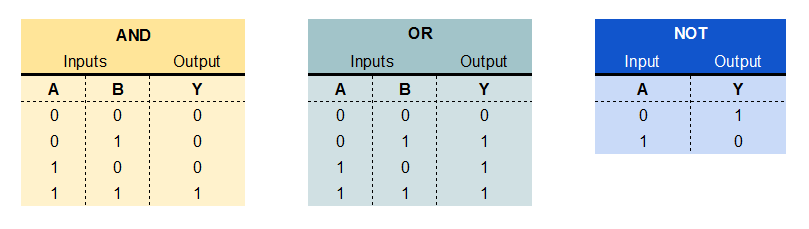
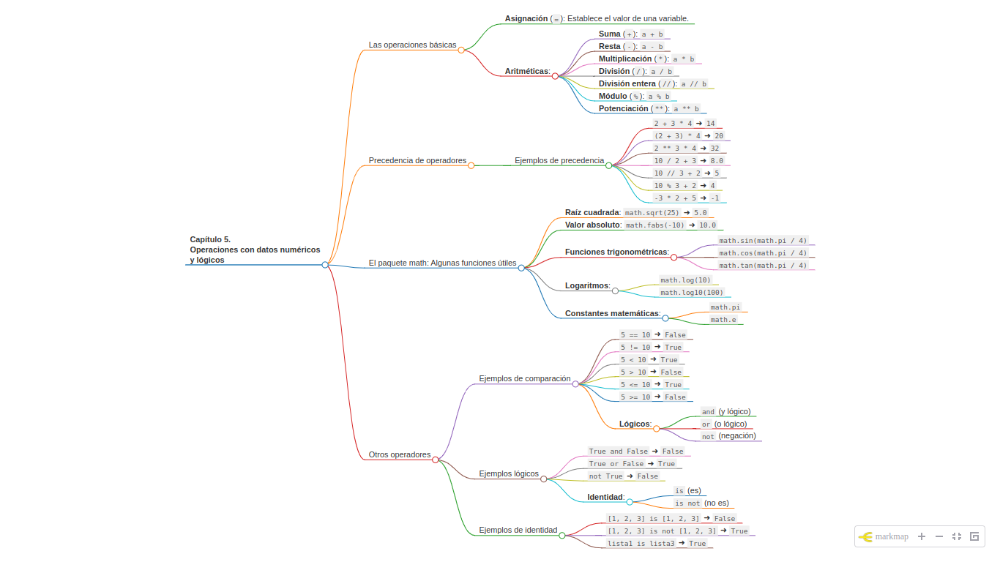

# Capítulo 5. Operaciones con datos numéricos y precedencia de operadores.

## Las operaciones básicas


Ya vimos en el capítulo 2 el operador asignación `=` el cual nos permite establecer el valor de una variable a un valor fijo. Éste no es el único operador que podemos implementar en Python. Python maneja muchos operadores para realizar operaciones aritméticas. En Python, los datos de tipo numérico admiten una variedad de operaciones matemáticas. Aquí tienes una descripción detallada de las operaciones que se pueden realizar con ejemplos:

1. **Suma (+):** Se utiliza para sumar dos números.

```python
a = 5
b = 3
suma = a + b  # El valor de suma será 8
```

2. **Resta (-):** Se utiliza para restar un número de otro.

```python
a = 5
b = 3
resta = a - b  # El valor de resta será 2
```

3. **Multiplicación (*):** Se utiliza para multiplicar dos números.

```python
a = 5
b = 3
multiplicacion = a * b  # El valor de multiplicacion será 15
```

4. **División (/):** Se utiliza para dividir un número entre otro.

```python
a = 6
b = 2
division = a / b  # El valor de division será 3.0 (en Python 3 la división siempre devuelve un número de punto flotante)
```

5. **División entera (//):** Se utiliza para realizar una división entera.

```python
a = 7
b = 2
division_entera = a // b  # El valor de division_entera será 3
```

6. **Módulo (%):** Se utiliza para obtener el resto de una división.

```python
a = 7
b = 3
resto = a % b  # El valor de resto será 1
```

7. **Potenciación (**):** Se utiliza para elevar un número a una potencia.

```python
a = 2
b = 3
potencia = a ** b  # El valor de potencia será 8
```

## Precedencia de operadores 


En Python, la precedencia de los operadores determina el orden en el que se evalúan las expresiones. Aquí tienes una lista de los operadores numéricos en Python ordenados por precedencia de mayor a menor:

1. `**` (exponente)
2. `+x`, `-x`, `~x` (unarios)
3. `*`, `/`, `//`, `%` (multiplicación, división, división entera, módulo)
4. `+`, `-` (adición, sustracción)

Es importante mencionar que los paréntesis (`()`) pueden ser utilizados para modificar el orden de evaluación y forzar la precedencia que desees.

A continuación, te mostraré algunos ejemplos para ilustrar la precedencia de operadores en Python:

```python
# Ejemplo 1
resultado = 2 + 3 * 4
print(resultado)  # Salida: 14
# Se evalúa la multiplicación primero, luego se suma.

# Ejemplo 2
resultado = (2 + 3) * 4
print(resultado)  # Salida: 20
# Se evalúa la suma dentro de los paréntesis primero, luego se multiplica.

# Ejemplo 3
resultado = 2 ** 3 * 4
print(resultado)  # Salida: 32
# Se evalúa el exponente primero, luego la multiplicación.

# Ejemplo 4
resultado = 10 / 2 + 3
print(resultado)  # Salida: 8.0
# Se evalúa la división primero, luego la suma.

# Ejemplo 5
resultado = 10 // 3 + 2
print(resultado)  # Salida: 5
# Se evalúa la división entera primero, luego la suma.

# Ejemplo 6
resultado = 10 % 3 + 2
print(resultado)  # Salida: 4
# Se evalúa el módulo primero, luego la suma.

# Ejemplo 7
resultado = -3 * 2 + 5
print(resultado)  # Salida: -1
# Se evalúa la multiplicación primero, luego se suma y se aplica el signo negativo.

# Ejemplo 8
resultado = 2 + 3 * -4
print(resultado)  # Salida: -10
# Se evalúa la multiplicación primero, luego se suma.
```

Estos ejemplos deberían ayudarte a entender cómo se aplican los operadores numéricos en Python y cómo puedes controlar el orden de evaluación mediante el uso de paréntesis.

## El paquete math: Algunas funciones bastante útiles.


Además de estas operaciones básicas, Python también proporciona funciones matemáticas incorporadas en el módulo `math` para realizar operaciones más avanzadas, como raíces cuadradas, funciones trigonométricas, logaritmos, etc. Aquí tienes una descripción detallada de algunas operaciones que se pueden realizar con el paquete `math` junto con ejemplos:

1. **Raíz cuadrada:** La función `sqrt()` se utiliza para calcular la raíz cuadrada de un número.
```python
import math
resultado = math.sqrt(25)  # El valor de resultado será 5.0
```

2. **Valor absoluto:** La función `fabs()` devuelve el valor absoluto de un número.
```python
import math
resultado = math.fabs(-10)  # El valor de resultado será 10.0
```

3. **Funciones trigonométricas:** El paquete `math` proporciona funciones trigonométricas como seno, coseno y tangente.
```python
import math
angulo = math.pi / 4
seno = math.sin(angulo)  # Calcula el seno del ángulo
coseno = math.cos(angulo)  # Calcula el coseno del ángulo
tangente = math.tan(angulo)  # Calcula la tangente del ángulo
```

4. **Logaritmos:** El paquete `math` incluye funciones para calcular logaritmos.
```python
import math
logaritmo_natural = math.log(10)  # Calcula el logaritmo natural de 10
logaritmo_base_10 = math.log10(100)  # Calcula el logaritmo en base 10 de 100
```

5. **Constantes matemáticas:** El paquete `math` también proporciona constantes matemáticas como π y e.
```python
import math
pi = math.pi  # Valor de π
euler = math.e  # Valor de e (número de Euler)
```

Estos son solo algunos ejemplos de las operaciones que se pueden realizar con el paquete `math` de Python. Este paquete es muy útil para realizar cálculos matemáticos avanzados en Python.

## Otros operadores 

En Python, los datos de tipo booleano representan valores de verdad, es decir, verdadero (`True`) o falso (`False`). Las operaciones con datos booleanos son esenciales para la toma de decisiones y el control de flujo en programas. Aquí tienes algunas operaciones y ejemplos:

1. **Operadores de Comparación:**


   
- `==` (igual)
- `!=` (no igual)
- `<` (menor que)
- `>` (mayor que)
- `<=` (menor o igual que)
- `>=` (mayor o igual que)

Ejemplos:

```python
x = 5
y = 10

igual = x == y
print(igual)  # Salida: False

no_igual = x != y
print(no_igual)  # Salida: True

menor_que = x < y
print(menor_que)  # Salida: True

mayor_que = x > y
print(mayor_que)  # Salida: False

menor_igual = x <= y
print(menor_igual)  # Salida: True

mayor_igual = x >= y
print(mayor_igual)  # Salida: False
```

1. **Operadores Lógicos:**
   
   - `and` (y lógico)
   - `or` (o lógico)
   - `not` (negación)


    

   Ejemplos:

   ```python
   a = True
   b = False

   y_logico = a and b
   print(y_logico)  # Salida: False

   o_logico = a or b
   print(o_logico)  # Salida: True

   negacion = not a
   print(negacion)  # Salida: False
   ```

2. **Operadores de Identidad:**
   
   - `is` (es)
   - `is not` (no es)

   Estos operadores se utilizan para comparar la identidad de los objetos.

   ```python
   lista1 = [1, 2, 3]
   lista2 = [1, 2, 3]
   lista3 = lista1

   es_igual = lista1 is lista2
   print(es_igual)  # Salida: False

   no_es_igual = lista1 is not lista2
   print(no_es_igual)  # Salida: True

   misma_identidad = lista1 is lista3
   print(misma_identidad)  # Salida: True
   ```

Estos son solo algunos ejemplos básicos de operaciones con datos booleanos en Python. Estas operaciones son fundamentales para construir expresiones lógicas y estructuras de control de flujo, como las declaraciones `if`, `else` y `while`.

____

## Un mapa mental para resumir el capítulo



____


Made with Love ❤️ by [@jelambrar96](https://github.com/jelambrar96)

[](https://www.buymeacoffee.com/jelambrar1)

Enero 2024